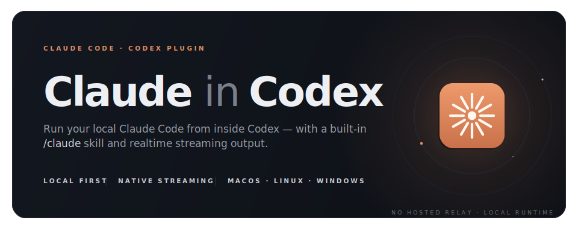
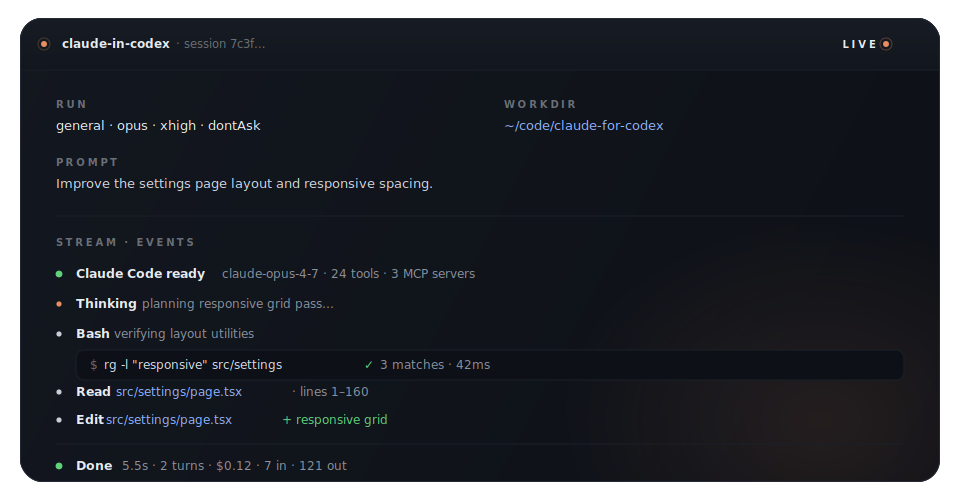
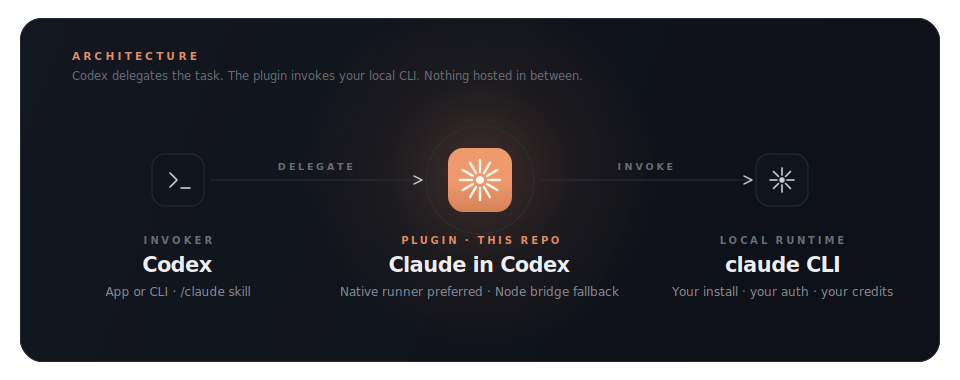

<div align="center">
  
</div>

<p align="center">
  <a href="./LICENSE"></a>&nbsp;&nbsp;
  <a href="https://developers.openai.com/codex/plugins"></a>&nbsp;&nbsp;
  <a href="https://www.anthropic.com/claude-code"></a>
</p>

<p align="center">
  <a href="#overview">Overview</a>&nbsp;&nbsp;·&nbsp;&nbsp;
  <a href="#realtime-preview">Preview</a>&nbsp;&nbsp;·&nbsp;&nbsp;
  <a href="#installation">Install</a>&nbsp;&nbsp;·&nbsp;&nbsp;
  <a href="#usage">Usage</a>&nbsp;&nbsp;·&nbsp;&nbsp;
  <a href="#architecture">Architecture</a>&nbsp;&nbsp;·&nbsp;&nbsp;
  <a href="#profiles">Profiles</a>&nbsp;&nbsp;·&nbsp;&nbsp;
  <a href="#validation">Validation</a>
</p>

<div align="center">
  
</div>

##  Overview

**Claude in Codex** runs your local Claude Code installation from inside Codex through a bundled `/claude` skill and a small portable bridge — nothing hosted, nothing in between.

- **Native local runner** when installed — the closest match to Claude's own realtime output.
- **Portable Node bridge** as a fallback when no native runner is present.
- **Your existing `claude` CLI, auth, and environment** — reused as-is. Your install, your credits, your machine.

##  Realtime preview

<div align="center">
  
</div>

The default `events` view surfaces what Claude is doing while it works — the delegated prompt and run settings, session metadata, per-tool progress (thinking, shell, reads, edits, writes, web, MCP), streamed assistant text, and a final summary with duration, turns, cost, and token counts.

| Mode | What you get |
| :--- | :--- |
| `events` *(default)* | Human-readable realtime stream — closest match to Claude's own output |
| `raw` | Exact NDJSON from `claude -p --output-format stream-json` |
| `trace` | Structured debug renderer with explicit `[claude-in-codex:…]` labels |

##  Installation

### Install globally from GitHub via npm

```bash
npm install -g github:xt0n1-t3ch/Claude-for-Codex
claude-in-codex-install
```

### Or clone and install

```bash
git clone https://github.com/xt0n1-t3ch/Claude-for-Codex.git
cd Claude-for-Codex
node ./scripts/install.mjs
```

### What the installer does

- Copies the plugin to `~/.codex/plugins/claude-in-codex`
- Updates `~/.agents/plugins/marketplace.json`
- Enables the plugin in `~/.codex/config.toml`
- Builds the native runner to `~/.codex/tools/claude/target/release/claude.exe` when Go is available
- Refreshes the installed bundle at `~/.codex/plugins/cache/…`

Restart Codex after install so the registry and plugin surfaces pick up the change.

### Requirements

| | |
| :--- | :--- |
| **Node.js** | on `PATH`, `>= 18.18.0` |
| **`claude` CLI** | on `PATH`, already signed in |
| **Go** | optional, used to build the native runner; the Node bridge still works without it |
| **Codex** | plugins enabled |

##  Usage

Inside Codex, point Claude at the current task in natural language:

```text
Use Claude to implement this feature.
Use Claude for a second-opinion review.
Use Claude to investigate or debug this issue.
```

Under the hood, the native runner and the portable bridge read the same JSON spec.

### macOS / Linux

```bash
SPEC="${TMPDIR:-/tmp}/claude-in-codex.spec.json"
cat > "$SPEC" <<'JSON'
{
  "workdir": "/path/to/repo",
  "profile": "design",
  "permissionMode": "acceptEdits",
  "streamVisibility": "events",
  "prompt": "Improve the settings page layout and responsive spacing. Stay inside the frontend slice."
}
JSON

node ./scripts/claude-in-codex.mjs --spec-file "$SPEC"
```

### Windows PowerShell

```powershell
$spec = Join-Path $env:TEMP 'claude-in-codex.spec.json'
@{
  workdir          = 'D:\YourRepo'
  profile          = 'design'
  permissionMode   = 'acceptEdits'
  streamVisibility = 'events'
  prompt           = 'Improve the settings page layout and responsive spacing. Stay inside the frontend slice.'
} | ConvertTo-Json -Depth 8 | Set-Content -Path $spec

node .\scripts\claude-in-codex.mjs --spec-file $spec
```

A ready-made sample spec lives at [`examples/basic.spec.json`](./examples/basic.spec.json).

##  Architecture

<div align="center">
  
</div>

Codex delegates the active task to the bundled `/claude` skill. The plugin prefers a native local runner for richer streaming, and cleanly falls back to the portable Node bridge when no runner is installed. Either path invokes the `claude` CLI already on your machine, using your install, auth, and model access.

##  Profiles

Each profile tunes the system prompt, default model, default effort, and tool permissions.

| Family | Aliases | Default model | Default effort |
| :--- | :--- | :---: | :---: |
| **Design** | `design` · `frontend` · `ui` · `ux` · `polish` | `claude-opus-4-7` | `medium` |
| **Audit** | `ui-audit` · `frontend-audit` · `ux-audit` | `claude-opus-4-7` | `medium` |
| **Review** | `review` · `second-opinion` | `claude-opus-4-7` | `medium` |
| **Planning** | `plan` · `architecture` · `architect` | `claude-opus-4-7` | `medium` |
| **Debug** | `challenge` · `debug` · `investigation` | `claude-opus-4-7` | `medium` |
| **Explore** | `explore` · `scout` | `haiku` | `medium` |
| **General** | `general` | `claude-opus-4-7` | `medium` |

Audit, review, plan, and explore are **read-only** by default — `Write`, `Edit`, `MultiEdit`, and `NotebookEdit` are disabled unless you explicitly broaden scope.

##  Validation

```bash
npm run build:native
node --test ./scripts/tests/command.test.mjs
node ./scripts/claude-in-codex.mjs doctor
```

The first command builds the native runner. The second runs the unit tests. The third is a lightweight environment probe that reports your Node version, your `claude` CLI version, and the native runner path. Exit code `0` means the `claude` CLI is reachable on your `PATH`.

<br />

<p align="center">
  <sub>
    No analytics · No hosted telemetry · Runs where you run Codex
    <br />
    <a href="./PRIVACY.md">Privacy</a>&nbsp;&nbsp;·&nbsp;&nbsp;<a href="./TERMS.md">Terms</a>&nbsp;&nbsp;·&nbsp;&nbsp;<a href="./LICENSE">Apache 2.0</a>
  </sub>
</p>

